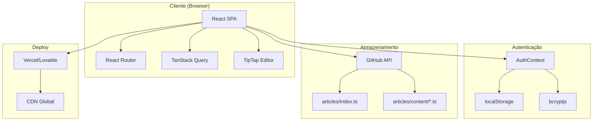
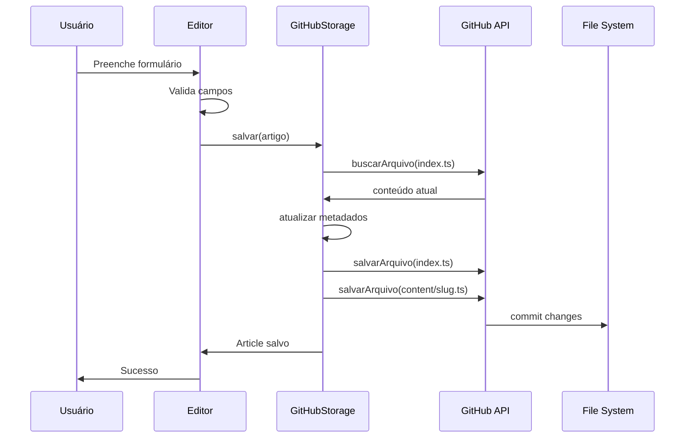
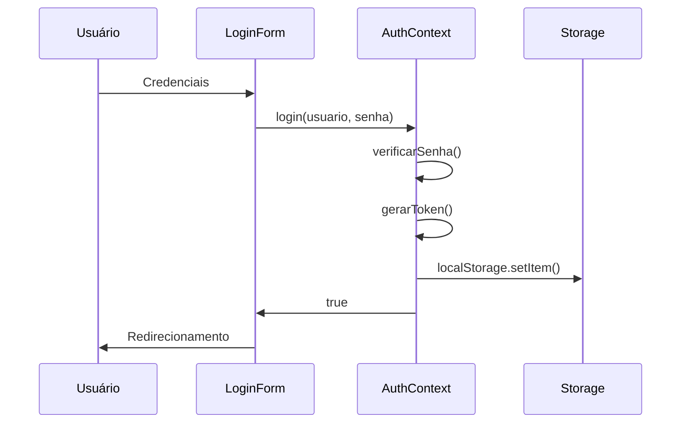
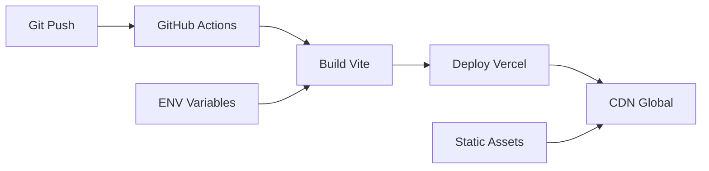

# 🏗️ ARQUITETURA - M. PEIXOTO ADVOGADOS

## 📋 VISÃO GERAL ARQUITETURAL

O sistema M. Peixoto Advogados utiliza uma arquitetura moderna **Single Page Application (SPA)** com gestão de conteúdo descentralizada através da API do GitHub, oferecendo uma solução robusta para publicação de artigos jurídicos.

---

## 🎯 ARQUITETURA DE ALTO NÍVEL



---

## 🏛️ PADRÕES ARQUITETURAIS

### 1. **Model-View-Controller (MVC) Adaptado**

```typescript
// MODEL: Dados e Estado
interface ArticleMetadata {
  id: string
  title: string
  content: string
  // ...
}

// VIEW: Componentes React
const ArticleList = ({ articles }: Props) => {
  return articles.map(article => <ArticleCard key={article.id} />)
}

// CONTROLLER: Hooks e Contextos
const useArticles = () => {
  const { data: articles } = useQuery({
    queryKey: ['articles'],
    queryFn: githubStorageV2.listar
  })
  return articles
}
```

### 2. **Repository Pattern**

```typescript
// Interface abstrata
interface ArtigoService {
  salvar: (artigo: ArtigoRascunho) => Promise<Article>
  listar: () => Promise<Article[]>
  buscarPorId: (id: string) => Promise<Article | undefined>
  excluir: (id: string) => Promise<void>
}

// Implementação concreta
class GitHubStorageServiceV2 implements ArtigoService {
  // Implementação específica para GitHub
}
```

### 3. **Context Provider Pattern**

```typescript
// Contexto centralizado de autenticação
export function AuthProvider({ children }) {
  const [isAuthenticated, setIsAuthenticated] = useState(false)
  const [usuario, setUsuario] = useState(null)

  return (
    <AuthContext.Provider value={{ isAuthenticated, usuario, login, logout }}>
      {children}
    </AuthContext.Provider>
  )
}
```

---

## 🗂️ ESTRUTURA DE CAMADAS

### **Camada de Apresentação**
```
src/components/
├── ui/                 # Primitivos de interface
├── Navigation.tsx      # Navegação global
├── LoginForm.tsx       # Autenticação
├── RedacaoEditor.tsx   # Editor de artigos
└── ProtectedRoute.tsx  # Controle de acesso
```

**Responsabilidades**:
- Renderização de componentes
- Interação do usuário
- Validação de formulários
- Estados de loading/erro

### **Camada de Negócio**
```
src/contexts/
├── AuthContext.tsx     # Lógica de autenticação
src/lib/
├── redacao-types.ts    # Tipos de domínio
src/utils/
└── auth.ts            # Utilitários de auth
```

**Responsabilidades**:
- Regras de negócio
- Validações de domínio
- Transformações de dados
- Cálculos específicos

### **Camada de Dados**
```
src/services/
├── github-storage-v2.ts  # Comunicação com API
src/data/
├── articles/
│   ├── index.ts          # Metadados
│   ├── types.ts          # Interfaces
│   └── content/          # Conteúdo dos artigos
```

**Responsabilidades**:
- Persistência de dados
- Comunicação com APIs
- Cache e otimizações
- Serialização/Deserialização

---

## 🔄 FLUXO DE DADOS

### **Fluxo de Criação de Artigo**



### **Fluxo de Autenticação**



---

## 📊 GESTÃO DE ESTADO

### **Estado Global (Context API)**

```typescript
// AuthContext - Estado de autenticação
interface AuthState {
  isAuthenticated: boolean
  usuario: string | null
  loading: boolean
}

// Não há estado global para artigos - usa TanStack Query
```

### **Estado Local (useState/useReducer)**

```typescript
// Estados de componentes específicos
const [loading, setLoading] = useState(false)
const [error, setError] = useState('')
const [formData, setFormData] = useState(initialState)
```

### **Cache de Servidor (TanStack Query)**

```typescript
// Cache inteligente de dados remotos
const { data: articles, isLoading, error } = useQuery({
  queryKey: ['articles'],
  queryFn: githubStorageV2.listar,
  staleTime: 5 * 60 * 1000, // 5 minutos
  cacheTime: 10 * 60 * 1000  // 10 minutos
})
```

---

## 🔌 INTEGRAÇÕES EXTERNAS

### **GitHub API Integration**

**Endpoints Utilizados**:
```http
GET  /repos/{owner}/{repo}/contents/{path}     # Buscar arquivo
PUT  /repos/{owner}/{repo}/contents/{path}     # Salvar arquivo
DELETE /repos/{owner}/{repo}/contents/{path}   # Excluir arquivo
```

**Autenticação**:
```typescript
headers: {
  'Authorization': `token ${github_token}`,
  'Accept': 'application/vnd.github.v3+json'
}
```

### **Vite Build System**

**Configurações Principais**:
```typescript
// vite.config.ts
export default defineConfig({
  server: { host: "::", port: 8085 },
  plugins: [react(), componentTagger()],
  resolve: { alias: { "@": path.resolve(__dirname, "./src") } }
})
```

---

## 🎨 PADRÕES DE DESIGN

### **Compound Component Pattern**

```typescript
// Card composto com subcomponentes
<Card>
  <CardHeader>
    <CardTitle>Título</CardTitle>
  </CardHeader>
  <CardContent>
    Conteúdo
  </CardContent>
</Card>
```

### **Render Props / Children as Function**

```typescript
// ProtectedRoute como wrapper
<ProtectedRoute>
  <RedacaoPage />
</ProtectedRoute>
```

### **Custom Hooks Pattern**

```typescript
// Hook personalizado para autenticação
export function useAuth() {
  const context = useContext(AuthContext)
  if (!context) {
    throw new Error('useAuth deve ser usado dentro de AuthProvider')
  }
  return context
}
```

---

## 🔄 CICLO DE VIDA DOS DADOS

### **Artigos - Lifecycle**

1. **Criação**
   ```typescript
   RedacaoEditor → validação → GitHubStorage → GitHub API → Commit
   ```

2. **Leitura**
   ```typescript
   React Query → Cache → GitHub API (se necessário) → Componente
   ```

3. **Atualização**
   ```typescript
   Editor → buscarPorId → carregar dados → editar → salvar → invalidate cache
   ```

4. **Exclusão**
   ```typescript
   Lista → confirmar → excluir metadata → excluir arquivo → refresh lista
   ```

### **Autenticação - Lifecycle**

1. **Login**
   ```typescript
   Form → AuthContext → verificar → gerar token → localStorage → redirect
   ```

2. **Verificação**
   ```typescript
   App load → verificar token → validar → set estado → render
   ```

3. **Logout**
   ```typescript
   Botão → AuthContext → limpar token → localStorage.remove → redirect
   ```

---

## 📈 PERFORMANCE E OTIMIZAÇÕES

### **Estratégias Implementadas**

1. **Code Splitting Automático (Vite)**
   ```typescript
   // Lazy loading automático de páginas
   const LazyPage = React.lazy(() => import('./Page'))
   ```

2. **Memoização de Componentes**
   ```typescript
   const MemoizedComponent = React.memo(ExpensiveComponent)
   ```

3. **Cache Inteligente (TanStack Query)**
   ```typescript
   // Evita requests desnecessários
   queryClient.prefetchQuery(['articles'])
   ```

4. **Separação Metadata/Content**
   ```typescript
   // Carrega apenas metadados para listas
   // Conteúdo sob demanda para visualização
   ```

### **Otimizações Pendentes**

- [ ] Virtual scrolling para listas grandes
- [ ] Service Worker para cache offline
- [ ] Lazy loading de imagens
- [ ] Bundle analysis e tree-shaking

---

## 🚀 DEPLOY E INFRAESTRUTURA

### **Pipeline de Deploy**



### **Configuração de Produção**

```typescript
// Build otimizado
"build": "vite build"

// Assets otimizados automaticamente
// - Minificação JS/CSS
// - Otimização de imagens
// - Bundle splitting
// - Tree shaking
```

---

## 🔧 EXTENSIBILIDADE E MANUTENIBILIDADE

### **Pontos de Extensão**

1. **Novos Providers de Storage**
   ```typescript
   interface ArtigoService {
     // Implementar para Supabase, Firebase, etc.
   }
   ```

2. **Novos Tipos de Conteúdo**
   ```typescript
   interface ContentType {
     type: 'article' | 'news' | 'case-study'
     // ...
   }
   ```

3. **Plugins de Editor**
   ```typescript
   const editor = useEditor({
     extensions: [StarterKit, ImagePlugin, VideoPlugin]
   })
   ```

### **Padrões de Manutenção**

- **TypeScript**: Tipagem forte previne erros
- **ESLint**: Padrões de código consistentes
- **Modularização**: Componentes reutilizáveis
- **Documentação**: README e comentários inline

---

## 📊 MÉTRICAS E MONITORAMENTO

### **Métricas Atuais**

- **Bundle Size**: ~2.5MB (desenvolvimento)
- **Load Time**: <3s (primeira visita)
- **Lighthouse Score**: 90+ (performance)

### **Monitoramento Recomendado**

```typescript
// Performance monitoring
console.time('article-load')
await loadArticle(id)
console.timeEnd('article-load')

// Error tracking
try {
  await operation()
} catch (error) {
  console.error('Operation failed:', error)
  // Enviar para Sentry/LogRocket
}
```

---

## 🔮 ROADMAP ARQUITETURAL

### **Curto Prazo (1-3 meses)**
- [ ] Implementar backend Node.js/Express
- [ ] Migrar autenticação para server-side
- [ ] Adicionar rate limiting
- [ ] Implementar cache Redis

### **Médio Prazo (3-6 meses)**
- [ ] Microserviços para diferentes domínios
- [ ] Database dedicado (PostgreSQL)
- [ ] Sistema de notificações
- [ ] Analytics integrado

### **Longo Prazo (6-12 meses)**
- [ ] PWA completo
- [ ] Modo offline
- [ ] Multi-tenancy
- [ ] API GraphQL

---

*Documentação atualizada em: Setembro 2024*
*Versão da arquitetura: 2.0*